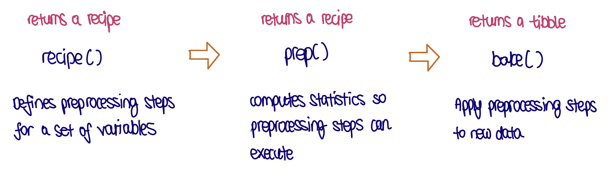

```{r, echo = FALSE, message = FALSE, warning = FALSE, warning = FALSE}
knitr::opts_chunk$set(
  message = FALSE,
  warning = FALSE,
  error = FALSE, 
  echo = TRUE,
  eval = FALSE,
  collapse = TRUE,
  comment = "#",
  fig.height = 4,
  fig.width = 8,
  fig.align = "center",
  cache = FALSE
)
library(emo)
```


## `r emo::ji("target")` Objective

The objectives for this week are to 

- practice plotting of data and models to help understand the fit.
- understand the purpose of breaking the model fitting into pre-processing with `recipes`,  model specification with `parsnip`, and `yardstick` to compute error.
- develop your ability to support your choice of model from among several.
- understand why to use orthogonal polynomials, for polynomial regression. 

## `r emo::ji("wrench")` Preparation 

Make sure you have these packages installed:

```
install.packages(c("tidyverse", "kableExtra", "tidymodels", "GGally", "ISLR", "here", "rsample", "mgcv", "gratia", patchwork"))
```

## `r emo::ji("book")` Reading and thinking

- Read and work through https://emilhvitfeldt.github.io/ISLR-tidymodels-labs/moving-beyond-linearity.html. 
- Think about the wages example and the relationship between wage and age. Read about [lurking variables here](https://courses.lumenlearning.com/wmopen-concepts-statistics/chapter/causation-and-lurking-variables-1-of-2/). 

## `r emo::ji("waving_hand")` Getting started

If you are in a zoom tutorial, say hello in the chat. If in person, do say hello to your tutor and to your neighbours. 

## `r emo::ji("gear")` Exercise 

```{r load_libraries}
# Load libraries
library(tidyverse)
library(ISLR)
library(tidymodels)
library(GGally)
library(mgcv)
library(patchwork)

# install.packages("<package name>")

# Set default theme for document
ggplot2::theme_set(theme_bw())
```

### 1. Fitting NRC rankings

In 2010, the National Research Council released rankings for all doctorate programs in the USA (https://en.wikipedia.org/wiki/United_States_National_Research_Council_rankings). The data was initially released and then only available for a fee. I managed to get a copy during the free period, and this is the data that we will use for this exercise. There hasn't been another set of rankings publicly released since then, and I don't know why. Only the rankings and statistics for Statistics programs are included in this data set.

Your job is to answer the question: "How is R Ranking related to rankings on research, student support and diversity?" using the 5th percentile for each of these quantities. Fit your best model, try using splines, and justify your choices.

#### a. 

Read the data. Rename the columns containing the variables of interest to `rank`, `research`, `student` and `diversity`). Using `recipes`, split the data into 2/3 training and 1/3 test sets.

```{r}
# Read-in data
nrc <- read_csv(here::here("data/nrc.csv")) 

# Select relevant variables  
nrc <- nrc %>% 
  select(rank = R.Rankings.5th.Percentile,
         research = Research.Activity.5th.Percentile,
         student = Student.Support.Outcomes.5th.Percentile,
         diversity = Diversity.5th.Percentile)
```

**Data description:**
- `rank`: Faculty ratings of the quality of each program
- `research`: Research activities such as no. of publications, no. of citations etc.
- `student`: Student support & outcomes outcomes
- `diversity`: Diversity of the faculty and students (demographics)

##### Splitting dataset using `rsample` package

```{r}
library(rsample)

# --- Set seed for reproducibility
set.seed(22)

# --- # Allocate 2/3 of the data as training, 1/3 as test set
train_test_split <- rsample::initial_split(nrc, prop = 2/3)

# --- Extract training and test set from rsplit object
nrc_train <- rsample::training(train_test_split) 
nrc_test <- rsample::testing(train_test_split) 
```

- `initial_split`: Splits data randomly into a single training and test set; returns an `rsplit` object
- `nrc_train` & `nrc_test`: objects with same variables as original dataset (`nrc`), but with selected proportion (*e.g. 2/3 for training set*) of observations

#### b. 

Make response vs predictor plots (*part b*) and predictor vs predictor plots (*part c*) of the training data. Explain the relationships, outliers, and how this would affect the modelling, and what you would expect the results of the modelling to be. (Hint: use `GGally::ggduo()`)

```{r}
# --- Response vs. predictor plot of training data
GGally::ggduo(data = nrc_train,
              columnsX = c("research", "student", "diversity"),
              columnsY = "rank")
```

- `ggduo`: Display two grouped data (e.g. response and predictors) in a plot matrix
- Rank has a strong relationship with research but very weak with the other two
- There is one outlier with good rank but not so good research rank.

#### c. 

Make a scatterplot matrix of the predictors, and discuss any potential problems like *multicollinearity.* (Hint: use `GGally::ggpairs()`)

```{r}
# --- Plot predictor vs predictor plot of training data
GGally::ggpairs(data = nrc_train,
                columns = c("research", "student", "diversity"))
```

**plot matrix:**
- *Diagonal*: Density plot of each individual variable
- *Lower triangle*: Pair-wise scatter plot of all pairs of variables
- *Upper triangle*: Correlation coefficients between each pair of variables
  - Correlation coefficients returns -1 ≤ 1

**Findings**
- There is no relationship between any pairs of predictors, and no obvious outliers or clusters. 
- Only small problem is that the distribution of each predictor is slightly right-skewed


#### d. 

Fit a linear model. Report estimates, model fit statistics, and the test RMSE. Make the plots to visually assess the fit, including observed vs fitted, residual vs fitted, histogram of residuals, normal probability plot of residuals, and the fitted vs each predictor.

##### Fit linear model using `parsnip` package

```{r fig.width=6, fig.height=6}
# --- Fit a linear model to the training data

lm_mod <- 
  parsnip::linear_reg() %>% # Specify type of model
  parsnip::set_engine("lm") # Specify engine

nrc_lm_fit <- 
  lm_mod %>% # parsnip model
  fit(rank ~ .,
      data = nrc_train) 
```

**Step 1: Specify the type of model**
- Specify model (e.g. model that uses linear regression)
  - Usually based on a mathematical structure
  
**Step 2: Specify the engine**
- Specify package or system to fit them model
  - Most often reflects software package
  
**Step 3: Declare the mode (if required)**
- Sets the class of the problem; usually influences how output will be collected
  - *e.g.* If outcome is numeric: `set_mode("regression")`
  - *e.g.* If outcome is qualitative/categorical: `set_mode("classification")`
- Step is not required if mode is already set in step 1

##### Using `broom` functions to extract model output & summary

```{r}
# --- Summarise model and check the fit using broom package

# Extract estimated coefficients 
broom::tidy(nrc_lm_fit)

# Extract model fit summaries
broom::glance(nrc_lm_fit)

# Extract residuals & predicted (fitted) values
nrc_lm_train_pred <- broom::augment(nrc_lm_fit, new_data = nrc_train) # Training set
nrc_lm_test_pred <- broom::augment(nrc_lm_fit, new_data = nrc_test) # Test set
```

- Training $R^2$ is `r round(rsq(nrc_lm_train_pred, truth = rank, estimate = .pred)$.estimate, 3)`. The model explains about `r round(rsq(nrc_lm_train_pred, truth = rank, estimate = .pred)$.estimate, 3)*100`\% of the variation in rank. 

##### Evaluate model fit using `yardstick` package

```{r}
yardstick::metrics(data = nrc_lm_test_pred, # test set
                   truth = rank, 
                   estimate = .pred)
```

- Test RMSE is 11.61.

###### `yardstick` package syntax

```{r, eval=FALSE}
yardstick::function(data = , 
                    truth = , # column with actual (observed) outcome values 
                    estimate = ) # predicted/fitted values
```

- `yardstick` package is used to judge model effectiveness.

```{r, eval=FALSE}
# One or more common performance estimates 
metrics(data = nrc_lm_test_pred, # test set
        truth = rank,
        estimate = .pred)

# Individual components
rsq(data = nrc_lm_test_pred, truth = rank, estimate = .pred)

# Create own set metrics
nrc_metrics <- metric_set(rsq, rmse)
nrc_metrics(data = nrc_lm_test_pred, truth = rank, estimate = .pred)
```

##### Model diagnostics

```{r}
# --- Model diagnostics (replicates gratia::appraise() function)
g
# Predicted vs actual 
p_f <- 
  ggplot(nrc_lm_train_pred) +
  geom_point(aes(x = .pred, y = rank)) +
  labs(title = "Predicted vs actual")

# Predicted vs residuals
p_e <- 
  ggplot(nrc_lm_train_pred) +
  geom_point(aes(x = .pred, y = .resid)) +
  geom_hline(yintercept = 0, colour = "red") +
  labs(title = "Predicted vs residuals")

# Distribution of residuals (errors)
p_h <- 
  ggplot(nrc_lm_train_pred, aes(x = .resid)) +
  geom_histogram(binwidth = 2.5, colour = "white") +
  geom_density(aes(y = ..count..), bw = 2, colour = "orange") +
  labs(title = "Distribution of residuals")

# QQ-plot
p_q <- ggplot(nrc_lm_train_pred, aes(sample = .resid)) +
  stat_qq() +
  stat_qq_line(colour = "orange") +
  labs(title = "QQ-plot",
       x = "Theoretical",
       y = "Sample") 

require(patchwork)
p_f + p_e + p_h + p_q
```

- The model fit is reasonably weak. 
- There is some moderate heteroskedasticity, with smaller spread at low ranks. 
- There are long tails, that is, outliers at both small and large values.

```{r fig.width=12}
# Plot the fitted model against each predictor

# Rank against research
p1 <- ggplot(nrc_lm_train_pred) +
  # Actual
  geom_point(aes(x = research, y = rank)) +
  # Predicted
  geom_point(aes(x = research, y = .pred),
             colour = "red")

# Rank against student
p2 <- ggplot(nrc_lm_train_pred) +
  # Actual
  geom_point(aes(x = student, y = rank)) +
  # Predicted
  geom_point(aes(x = student, y = .pred),
             colour = "red")

# Rank against diversity
p3 <- ggplot(nrc_lm_train_pred) +
  # Actual
  geom_point(aes(x = diversity, y = rank)) +
  # Predicted
  geom_point(aes(x = diversity, y = .pred),
             colour = "red")

p1 + p2 + p3
```

- The plots against individual predictors shows that `research` (**Strong positive r/s**) is the only variable strongly contributing to the fit
  - which is supported by the significance tests associated with each parameter estimate.

#### e. 

Fit a splines model. Report estimates, model fit statistics, and the test RMSE. Make the plots to visually assess the fit, including observed vs fitted, residual vs fitted, histogram of residuals, normal probability plot of residuals, and the fitted vs each predictor.

##### Fit model with natural splines with `recipe`

##### `recipe` 

```{r, eval=FALSE}
# --- recipe syntax

recipe(formula = response ~ predictors, # indicate outcome & predictors
			 data = <data frame>) %>% # used to record names & type of each variable
  # Feature engineering (performed in order)
  step_*() 
```

- `recipe()` is to define preprocessing steps for a set of variables
- Full list of `step_*` functions: https://recipes.tidymodels.org/reference/index.html 


```{r}
# --- Create recipe

nrc_ns_rec <-
  # Record names & type of each variable
  recipes::recipe(rank ~ research + student + diversity,
                  data = nrc_train) %>% 
  # natural spline
  recipes::step_ns(all_predictors(), deg_free = 3)
```

```{r}

```

```{r}
# --- Visually check preprocessing results

nrc_ns_rec %>% 
  prep() %>%
  bake(new_data = nrc_train)
```

```{r}
library(workflows)

# --- Define workflow

nrc_ns_wf <- workflows::workflow() %>%
  workflows::add_recipe(nrc_ns_rec) %>% # recipe
  workflows::add_model(lm_mod) # parsnip model
  
# Fit workflow that consists of a recipe & a model onto training set
nrc_ns_fit <- fit(nrc_ns_wf, data = nrc_train)
```

- workflow includes (1) preprocessing steps, (2) model fit (or formula)

##### Using `broom` functions to extract model output & summary

```{r}
# --- `broom` function to extract key information of model object

# Extract estimated coefficients as a tidy table
broom::tidy(nrc_ns_fit)

# Extract model fit summaries
broom::glance(nrc_ns_fit)

# Extract residuals & fitted values, adds argument into a data frame
# augment for splines only extracts the fitted values and not residuals

# Training set
nrc_ns_train_pred <- 
  broom::augment(nrc_ns_fit, new_data = nrc_train) %>%
  mutate(.resid = rank - .pred)

# Test set
nrc_ns_test_pred <-
  broom::augment(nrc_ns_fit, new_data = nrc_test) %>%
  mutate(.resid = rank - .pred)
```

- Training $R^2$ is `r round(glance(nrc_ns_fit)$r.squared, 3)`. This model explains about `r round(glance(nrc_ns_fit)$r.squared, 3)*100`\% of the variation in rank.

##### Evaluate model fit using `yardstick` package

```{r}
# --- Judging model effectiveness using `yardstick` package 
yardstick::metrics(data = nrc_ns_test_pred, # test set 
                   truth = rank, 
                   estimate = .pred)
```

- Test RMSE is `r round(rmse(nrc_ns_test_pred, truth = rank, estimate = .pred)$.estimate, 2)`
- The use of splines did not improve the model (based on the test RMSE, $R^2$ and MAE) relative to the linear model
  - Lower $R^2$ and higher RMSE relative to the linear model

##### Model diagnostics

```{r fig.width = 6, fig.height = 6}
# QQ plot
ps_q <- ggplot(nrc_ns_train_pred, aes(sample = .resid)) +
  stat_qq() +
  stat_qq_line(colour = "red") +
  xlab("theoretical") + ylab("sample")

# Fitted & residual
ps_e <- ggplot(nrc_ns_train_pred) +
  geom_point(aes(x = .pred, y = .resid)) +
  geom_hline(yintercept = 0, colour = "red")

# Distribution of residuals
ps_h <- ggplot(nrc_ns_train_pred, aes(x = .resid)) +
  geom_histogram(binwidth = 2.5, colour = "white") +
  geom_density(aes(y = ..count..), bw = 2, colour = "orange")

# Actual & predicted
ps_f <- ggplot(nrc_ns_train_pred) +
  geom_point(aes(x = .pred, y = rank))

ps_q + ps_e + ps_h + ps_f 
```

```{r fig.width=12}
# Plot the fitted model against each predictor
# Black: Observed, blue: Fitted

ps1 <- ggplot(nrc_ns_train_pred) +
  geom_point(aes(x = research, y = rank)) +
  geom_point(aes(x = research, y = .pred),
             colour = "blue")

ps2 <- ggplot(nrc_ns_train_pred) +
  geom_point(aes(x = student, y = rank)) +
  geom_point(aes(x = student, y = .pred),
             colour = "blue")

ps3 <- ggplot(nrc_ns_train_pred) +
  geom_point(aes(x = diversity, y = rank)) +
  geom_point(aes(x = diversity, y = .pred),
             colour = "blue")

ps1 + ps2 + ps3
```

#### f. 

Fit a GAM model. Report estimates, model fit statistics, and the test RMSE. Make the plots to visually assess the fit, including observed vs fitted, residual vs fitted, histogram of residuals, normal probability plot of residuals, and the fitted vs each predictor.

##### Fit Generalised Additive model (GAM) model

```{r fig.width=6, fig.height=6}
# mgcv::gam is not yet integrated with tidymodels
## Use conventional model fitting instead

nrc_gam <- 
  mgcv::gam(rank ~
        s(research) +
        s(student) + 
        s(diversity), 
        data = nrc_train)
```

- r/s between predictors and response follow smooth patterns that can be linear or non-linear
- Model is fit additive, suggesting that the effects of the predictors can be interpreted independently (holding other variables constant).
  - refer to [lecture-2b slide 13](https://iml.numbat.space/lectures/lecture-02b#13) for formula

##### Using `broom` functions to extract model output & summary

```{r}
# Extract estimated coefficients as a tidy table
broom::tidy(nrc_gam)

# Extract model fit summaries
broom::glance(nrc_gam)

# --- Extract residuals & fitted values, adds argument into a data frame

# Training set
nrc_gam_train_pred <- 
  augment(nrc_gam, new_data = nrc_train) %>%
  rename(.pred = .fitted)

# Test set
nrc_gam_test_pred <- 
  augment(nrc_gam, newdata = nrc_test) %>%
  rename(.pred = .fitted) %>%
  mutate(.resid = rank - .pred)
```

- GAMs do not report $R^2$
- Deviance is `r round(glance(nrc_gam)$deviance, 1)`, which is interpreted as what the model DOES NOT explain.
- Compare this with the overall total sum of squares of the response variable** `r round(sum((nrc_train$rank - mean(nrc_train$rank))^2), 1)`; would indicate that model explains about 56% of the variation in rank.


##### Evaluate model fit using `yardstick` package

```{r}
yardstick::metrics(nrc_gam_test_pred, truth = rank, estimate = .pred)
```

- Test RMSE is** `r round(rmse(nrc_gam_test_pred, truth = rank, estimate = .pred)$.estimate, 1)`.


##### Model diagnostics

```{r}
library(gratia) 

gratia::draw(nrc_gam, residuals = TRUE)

# Model diagnostics
gratia::appraise(nrc_gam)
```

```{r fig.width=12}
# Plot the fitted model against each predictor
pg1 <- ggplot(nrc_gam_train_pred) +
  geom_point(aes(x = research, y = rank)) +
  geom_point(aes(x = research, y = .pred),
             colour="blue")

pg2 <- ggplot(nrc_gam_train_pred) +
  geom_point(aes(x = student, y = rank)) +
  geom_point(aes(x = student, y = .pred),
             colour="blue")

pg3 <- ggplot(nrc_gam_train_pred) +
  geom_point(aes(x = diversity, y = rank)) +
  geom_point(aes(x = diversity, y = .pred),
             colour="blue")

pg1 + pg2 + pg3
```

#### g. 

Based on the model fit statistics, and test mse, and plots, which model is best? How do the predictors relate to the rank? Are all the predictors important for predicting rank? Could the model be simplified?

```{r}
# Create own set of metrics
nrc_metrics <- yardstick::metric_set(rmse, rsq)

bind_rows(
  nrc_metrics(nrc_gam_test_pred, truth = rank, estimate = .pred) %>% mutate(model = "gam"),
  nrc_metrics(nrc_lm_test_pred, truth = rank, estimate = .pred) %>% mutate(model = "lm"),
  nrc_metrics(nrc_ns_test_pred, truth = rank, estimate = .pred) %>% mutate(model = "ns")
) %>% 
  arrange(.metric)
```


- Linear model is the best model, when comparing the test RMSE and $R^2$
  - We can also say that the models performed similarly, so we choose the simplest (easiest to interpret) one, linear regression.
- It appears that `research` is the only significant predictor in the dataset


### 2. (IF TIME ALLOWS) Lurking variables

#### a. 

The wages data poses an interesting analytical dilemma. There appear to be two wage clusters, one small group with relatively consistent high wage, and the other big group with lower and varied wages. Make a histogram or a density plot of wage to check this more carefully. 

```{r}
# Read-in dataset
Wage <- ISLR::Wage

# Distribution of wage
ggplot(Wage, aes(x = wage)) + geom_density()
```

- Distribution appears to be bimodal, indicating that there are two different groups

#### b. 

What do you think might have caused this? Check the relationship between wage, and other variables such as `jobclass`. Do any of the other variables provided in the data explain the clustering?

```{r}
a1 <- ggplot(Wage, aes(x = age, y = logwage, colour = jobclass)) +
  geom_point(alpha = 0.5) +
  scale_colour_brewer("", palette = "Dark2") +
  theme(legend.position = "none")

a2 <- ggplot(Wage, aes(x = age, y = logwage, colour = health)) +
  geom_point(alpha = 0.5) +
  scale_colour_brewer("", palette = "Dark2") +
  theme(legend.position = "none")

a3 <- ggplot(Wage, aes(x = age, y = logwage, colour = health_ins)) +
  geom_point(alpha = 0.5) +
  scale_colour_brewer("", palette = "Dark2") +
  theme(legend.position = "none")

a4 <- ggplot(Wage, aes(x = age, y = logwage, colour = race)) +
  geom_point(alpha = 0.5) +
  scale_colour_brewer("", palette = "Dark2") +
  theme(legend.position = "none")

a5 <- ggplot(Wage, aes(x = age, y = logwage, colour = maritl)) +
  geom_point(alpha = 0.5) +
  scale_colour_brewer("", palette = "Dark2") +
  theme(legend.position = "none")

a1 + a2 + a3 + a4 + a5
```

- As the wage variable is right skewed, we take a log transformation
- No other variable in this collected data explains the cluster of salaries higher than log `wage` of $5.
  - This is very likely, though, to be something simple like a "manager" position, and would be best called a "lurking variable".

#### c. 

The textbook (Section 7.8.1 p.315) includes an analysis where a separate logistic model where a binary response ($\leq 250$, $>250$) is used. Why doesn't this make sense? 

An alternative approach is to treat this as a "lurking variable", let's call it "manager", create a new predictor and include this in the model. Alternatively, we could treat the high group as outliers, and exclude them from the analysis. The argument for these values are likely due to some unobserved factor, and their presence affects the ability to accurately model the rest of the data. 

**There is little support for predicting the wage above or below $250 on any of the variables available, which means it would be a weak model, at best.**

### 3. (IF TIME ALLOWS) Explore the polynomial model fitting

#### a. 

This builds from the polynomial model fit for the Wage data, using variables wage and age, in Figure 7.1. 

The function `poly` is a convenient way to generate a fourth-degree polynomial. By default it uses "orthogonal polynomials". 

```{r fig.width=3, fig.height=12, out.width="50%"}
# Read-in data
Wage <- as_tibble(ISLR::Wage)
```

```{r}
# Fit orthogonal polynomials

# Recipe
rec_poly <- recipe(wage ~ age, data = Wage) %>%
  # Orthogonal polynomials
  step_poly(age, degree = 4)

# Define workflow
poly_wf <- workflow() %>%
  add_model(lm_mod) %>%
  add_recipe(rec_poly) 

poly_fit <- fit(poly_wf, data = Wage)
```

```{r}
# Extract estimated coefficients 
broom::tidy(poly_fit)
```

#### b. 

We can request that "raw" polynomials are generated instead, with the `raw=TRUE` argument. 

```{r}
# --- Fit raw polynomials
rec_raw_poly <- 
  recipe(wage ~ age, data = Wage) %>%
  # Raw polynomials
  step_poly(age, degree = 4, options = list(raw = TRUE))

# Define workflow
raw_poly_wf <- workflow() %>%
  add_model(lm_spec) %>%
  add_recipe(rec_raw_poly)

raw_poly_fit <- fit(raw_poly_wf, data = Wage)
```

```{r}
# Extract estimated coefficients
broom::tidy(raw_poly_fit)
```


#### c. 

The coefficients are different, but effectively the fit is the same, which can be seen by plotting the fitted values from the two models.

```{r fig.show='hide'}
wage_fit <- 
  Wage %>% 
  # Obtain predicted values
  bind_cols(predict(poly_fit, Wage),
            predict(raw_poly_fit, Wage)) %>%
  rename(.pred_poly = .pred...12, 
         .pred_raw_poly = .pred...13) 

# Compare fitted values of raw and orthogonal polynomials
ggplot(wage_fit, 
       aes(x = .pred_poly,
           y = .pred_raw_poly)) + 
  geom_point() + 
  theme(aspect.ratio = 1)
```

#### d. 

To examine the differences between orthonormal polynomials and "raw" polynomials, we can make scatterplot matrices of the two sets of polynomials.

```{r fig.show='hide'}
p_orth <- as_tibble(poly(Wage$age, 4))
ggscatmat(p_orth)
p_raw <- as_tibble(poly(Wage$age, 4, raw = TRUE))
ggscatmat(p_raw)
```

- As higher order raw polynomials are added multicollinearity is introduced, orthogonal polynomials add perturbations to the function preventing linear dependency between terms.**
- Although coefficients are different, the fit are effectively the same (as seen in part c)
  - Orthonormal polynomials avoid collinearity and retains interpretability.

# e. 

**Think about:** What is the benefit of using orthonomal polynomials?

**As higher order raw polynomials are added multicollinearity is introduced. The orthogonal polynomials add perturbations to the function preventing linear dependency between terms.**

## 💬 Class discussion exercises, part of the wrap up

Why do you think polynomials and splines considered to be part of `recipes` rather than the model fitting?

**Both of these are transformations of the predictors, and are best considered to be pre-processing (feature engineering) of the data prior to modeling.** 

## `r emo::ji("stop_sign")` Wrapping up

Talk to your tutor about what you think you learned today, what was easy, what was fun, what you found hard.
