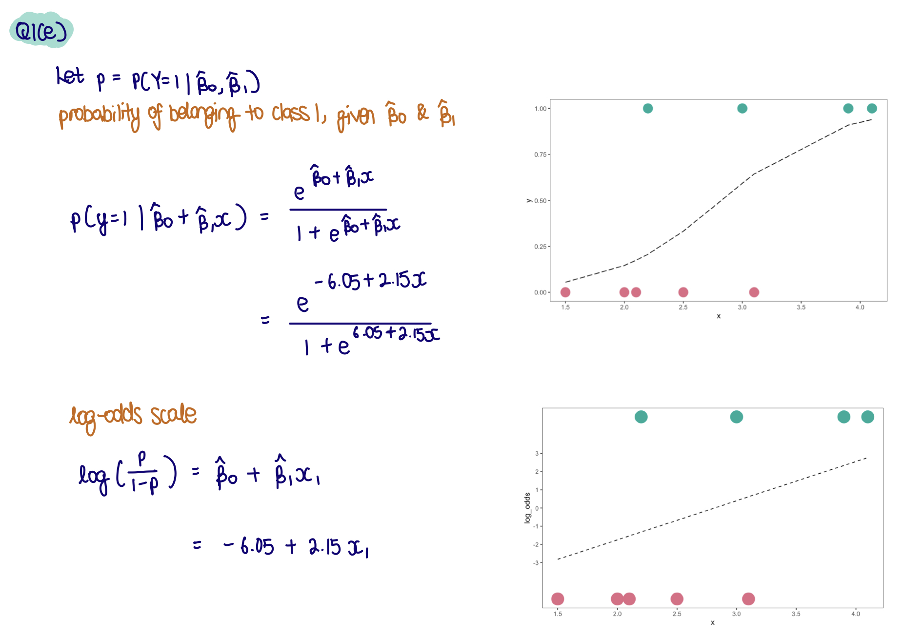

```{r, echo = FALSE, message = FALSE, warning = FALSE, warning = FALSE}
knitr::opts_chunk$set(
  message = FALSE,
  warning = FALSE,
  error = FALSE, 
  eval = FALSE,
  collapse = TRUE,
  comment = "#",
  fig.height = 4,
  fig.width = 8,
  fig.align = "center",
  cache = FALSE
)
library(emo)
```


# `r emo::ji("target")` Objective

The objectives for this week are to 

- examine the mathematics involved in re-writing the logistic regression model and linear discriminant analysis rules
- compute and interpret dimension reductions using PCA 
- apply PCA to examine temporal trends

# `r emo::ji("wrench")` Preparation 

Make sure you have these packages installed:

```
install.packages(c("tidyverse", "kableExtra",  "viridisLite", "plotly", "mvtnorm", "GGally"))
```

## `r emo::ji("book")` Reading 

- Textbook section 4.3, 12.2

# `r emo::ji("waving_hand")` Getting started

If you are in a zoom tutorial, say hello in the chat. If in person, do say hello to your tutor and to your neighbours. 

# `r emo::ji("gear")` Exercises 

## 1. Logistic regression

This question expects you to work through some equations for logistic regression, by hand, using the following data:

```{r setup}
library(tidyverse)
library(broom)
library(kableExtra)
library(colorspace)
library(tidymodels)
library(ggrepel)
library(kableExtra)
library(viridisLite)

# Set default theme for document
ggplot2::theme_set(theme_bw())
```

```{r}
d <-
  tibble(
    x = c(1.5, 2.0, 2.1, 2.2, 2.5, 3, 3.1, 3.9, 4.1),
    y = c(0, 0, 0, 1, 0, 1, 0, 1, 1)
  )

kable(d) %>% 
  kable_styling(full_width=FALSE)
```

### a. 

Write out likelihood function, as function of $\beta_0$ and $\beta_1$. (The equation in lecture 3a, at the top of slide 9 is the one you need.)

$$l(\beta_0, \beta_1) = \prod_{i=1}^9p(x_i)^{y_i}(1-p(x_i))^{(1-y_i)}$$

### b.

Show that the log likelihood 

$$\sum_{i=1}^9 \{y_i\log{p(x_i)} +(1-y_i)\log{(1-p(x_i))}\}$$

where $p(x_i) = P(Y=1|x_i) = \frac{1}{e^{-z_i}+1} = \frac{e^{z_i}}{e^{z_i}+1}$ and $z_i=\beta_0 + \beta_1x_i$, can be written as 

$$\sum_{i=1}^9\{y_i(\beta_0+\beta_1x_i)-\log{(1+e^{\beta_0+\beta_1x_i})}\}$$. 

Justify each of the steps you make in the algebra. (You can fill in the gaps below.)

$$
\begin{align*}
\log~l(\beta_0, \beta_1) = &\sum_{i=1}^9 \{y_i\log{p(x_i)} +(1-y_i)\log{(1-p(x_i))}\} ~~~ \mbox{log of a product is a sum of logs}\\
 = &\sum_{i=1}^9~\{y_i(\log p(x_i)-\log(1-p(x_i))) + \log (1-p(x_i))\} ~~~ \mbox{group } y_i\\
 = &\sum_{i=1}^9~y_i\log\frac{p(x_i)}{(1-p(x_i))} + \log (1-p(x_i)) ~~~ \mbox{difference of logs is a log of quotient} \\
 = &\sum_{i=1}^9 \{y_i\log\frac{\frac{e^{z_i}}{e^{z_i}+1}}{(1-\frac{e^{z_i}}{e^{z_i}+1})} + \log (1-\frac{e^{z_i}}{e^{z_i}+1})\} ~~~ \mbox{substitute } p(x_i) = \frac{e^{z_i}}{e^{z_i}+1} \\
 = &\sum_{i=1}^9 \{y_i\log\frac{e^{z_i}}{1+e^{z_i}-e^{z_i}} + \log (1-\frac{1+e^{z_i}-e^{z_i}}{1+e^{z_i}})\} ~~~ \mbox{reduce} \\
 = & \sum_{i=1}^9 \{y_i\log e^{z_i} + \log\frac{1}{1+e^{z_i}}\} ~~~ \mbox{reduce}\\
 = & \sum_{i=1}^9 \{y_i z_i - \log (1+e^{z_i})\} ~~~ \mbox{log of exp, and invert quotient} \\
 = &\sum_{i=1}^9\{y_i(\beta_0+\beta_1x_i)-\log{(1+e^{\beta_0+\beta_1x_i})}\} ~~~ \mbox{substitute } z_i=\beta_0 + \beta_1x_i
\end{align*}
$$

```{r, eval=FALSE}
# See image for further breakdown

```


### c.

Plot the function for different values of $\beta_0$ and $\beta_1$, or if you prefer, you can solve the equation analytically, to find the maximum, and thus to provide parameter estimates. 

```{r}
# Write log-likelihood function from Q1(b)
likelihood <- function(x, y, b0, b1) {
  sum(y * (b0 + b1 * x) - log(1 + exp(b0 + b1 * x)))
}

# Possible set of values for b0 & b1 
# Values are set arbitrarily (based on a number of trial & error)
d_grid <- expand_grid(b0 = seq(-8, 4, 0.05), 
                      b1 = seq(1, 4, 0.05))

d_grid <- d_grid %>%
  # For each set
  rowwise() %>%
  # Compute likelihood
  mutate(l = likelihood(d$x, d$y, b0, b1)) %>%
  ungroup()

# Extract maximum likelihood based on the set of values
estimates <- d_grid %>% 
  arrange(desc(l)) %>% 
  slice(1)

ggplot(d_grid) +
  # Colour log-likelihood values for each set of b0 & b1 valeus
  geom_tile(aes(x=b0, y=b1, fill=l)) +
  scale_fill_viridis_c() +
  # Show values of b0 & b1 for the maximum log-likelihood estimation as a point
  geom_point(data = estimates, aes(x = b0, y = b1), 
             colour = "black") +
  theme_bw() +
  theme(aspect.ratio=1)
```

### d.

Check that you got it correct, by actually fitting the model.

```{r}
# This code fits the model to check our calculations

# Specify logistic regression model
logistic_mod <- logistic_reg() %>% 
  set_engine("glm") %>%
  set_mode("classification") 

# Create new variable with response as a factor
d <- d %>%
  mutate(y_f = factor(y))

# Fit logistic regression
d_fit <- 
  logistic_mod %>% 
  fit(y_f ~ x, 
      data = d)
```

```{r}
# Extract estimated coefficients
tidy(d_fit)

# Compare to our estimates using numerical optimisation
# Difference is probably due to rounding error
estimates
```

```{r}
# Extract model fit summaries
glance(d_fit)
```

### e.

Write down the model equation using the parameter estimates.

```{r}

```


### f. 

Plot your data and the fitted model.

```{r}
# Change the beta values as necessary
d <- d %>%
  mutate(pred = (exp(-6.05 + 2.15*x))/(1+exp(-6.05 + 2.15*x)))

# Plot fitted values on probability scale
ggplot(d, aes(x = x, y = y)) +
  geom_point() +
  geom_line(aes(y = pred), colour = "#ff7f00")
```

### Extras: Plotting fitted values on probability and log-odds scale
 
```{r}
# Extract predictions on the probability scale - b0 + b1x1
d_aug_prob <- augment(d_fit$fit,
                      new_data = d,
                      type.predict = "response")

# Create numerical variable for response
d_aug_prob <- d_aug_prob %>% 
  mutate(y = as.numeric(as.character(y_f)),
         .before = y_f)

# Plot fitted values for probability scale
d_aug_prob %>% 
  ggplot() +
  geom_point(aes(x = x, y = y, colour = y_f)) +
  geom_line(aes(x = x, y = .fitted))

# Or use stat_smooth

d %>% 
  ggplot(aes(x = x, y = y)) +
  geom_point(aes(colour = y_f)) +
  stat_smooth(method = "glm", 
              method.args = list(family = "binomial"),
              se = FALSE)

# --- Using function 
# More precise (instead of connecting the dots)

inverse_logit_fun <- function(x){
  (exp(-6.05 + 2.15*x)) / (1+exp(-6.05 + 2.15*x))
}

d %>% 
  ggplot(aes(x = x,
             y = y)) +
  geom_point() +
  geom_function(fun = inverse_logit_fun,
                colour = "#ff7f00")
```


```{r}
# Extract predictions on the log odds scale
d_aug_logodds <- augment(d_fit$fit,
                         new_data = d,
                         type.predict = "link")

# Create numerical variable for response
d_aug_logodds <- d_aug_logodds %>% 
  mutate(y = as.numeric(as.character(y_f)),
         .before = y_f)

# Plot fitted values on the log odds scale
d_aug_logodds %>% 
  ggplot() +
  geom_line(aes(x = x, y = .fitted))
```


## 2. Principal Component Analysis

Here we are going to examine cross-rates for different currencies relative to the US dollar, to examine how the currencies changed as COVID-19 appeared. Some currencies moved in similar directions, and some opposite, some reacted strongly, and others not at all. PCA can help you to extract these differences. 

A cross-rate is *an exchange rate between two currencies computed by reference to a third currency, usually the US dollar.*

The data file `rates_Nov19_Mar20.csv` was extracted from https://openexchangerates.org.

### a.

What's the data? Make a plot of the Australian dollar against date. Explain how the Australian dollar has changed relative to the US dollar over the 5 month period.

```{r}
# Read-in data
rates <- read_csv(here::here("data/rates_Nov19_Mar20.csv"))

# Time plot: AUD against USD
ggplot(rates, aes(x = date, y = -AUD)) + geom_line()
```

* AUD weakened against the US dollars, with a large decline in mid-march
  * fluctuation probably caused by COVID-19, which affected the world's economy

### b. 

You are going to work with these currencies: AUD, CAD, CHF, CNY, EUR, GBP, INR, JPY, KRW, MXN, NZD, RUB, SEK, SGD, ZAR. List the names of the countries and currency name that these codes refer to. Secondary question: why is the USD a constant 1 in this data. 

* *AUD*: Australian dollar
* *CAD*: Canadian dollars 
* *CHF*: Swiss franc
* *CNY*: Chinese Yuan
* *EUR*: Euro
* *GBP*: British pound
* *INR*: Indian rupee
* *JPY*: Japanese yen
* *KRW*: Korean won
* *MXN*: Mexican peso
* *NZD*: New Zealand dollar
* *RUB*: Russian ruble
* *SEK*: Swedish krone
* *SGD*: Singapore dollars
* *ZAR*: South African rand

Countries peg (fix) their currency to the dollar such that the US is the base rate, against which all other currencies are compared. 


### c.

The goal of the Principal Component Analysis (PCA) is to examine the relative movement of this subset of currencies, especially since Covid-19 emerged until the end of March. PCA is used to summarise the volatility (variance) in the currencies, relative to each other. To do this you need to: 

*Standardise* all the currencies, individually. The resulting values will have a mean 0 and standard deviation equal to 1.

*Flip the sign* so that high means the currency strengthened against the USD, and low means that it weakened. Its easier to explain trends, if you don't need to talk with double-negatives.

```{r}
# Flip the sign & standardise variables
rates_sub <- rates %>%
  select(date, AUD, CAD, CHF, CNY, EUR, GBP, INR, JPY, KRW, MXN, NZD, RUB, SEK, SGD, ZAR) %>%
  mutate(across(where(is.numeric), ~ -1 * (.x - mean(.x))/sd(.x)))
  # mutate_if(is.numeric, function(x) -1*(x-mean(x))/sd(x))

# Convert to long format
rates_sub_long <- rates_sub %>% 
  pivot_longer(cols = AUD:ZAR,
               names_to = "currency",
               values_to = "crossrate") 
```

Make a plot of all the currencies to check the result.

```{r}
# Time plot
ggplot(rates_sub_long, 
       aes(x = date, y = crossrate, colour = currency)) +
  geom_line() +
  scale_colour_viridis_d("")
```

```{r}
# Interactive plot to browse the currencies
plotly::ggplotly()
```

### d. 

Conduct a principal component analysis on the subset of currencies. The base function `prcomp` can be used for this. You need to work from a wide format of the data, where dates are in the columns, and currencies are in the rows. Normally, PCA operates on standardised variables but for this data, you need to NOT standardise each date. Think about why this is best.

#### i. 

Why is this data considered to be high-dimensional?

```{r}
# Convert to wide format
rates_sub_wide <- rates_sub_long %>%
  pivot_wider(id_cols = currency,
              names_from = date,
              values_from = crossrate)
```

* There are many more variables ($p$) than observations ($n$), because we're considering dates to be variables & currencies to be observations.

#### ii.

Conduct principal component analysis on the subset of currencies

```{r}
rates_pca <- 
  stats::prcomp(rates_sub_wide %>% select(-currency),
                scale = FALSE) # no need to standardise
```

```{r, eval=FALSE}
# PC scores (can be used to draw biplots)
rates_pca$x 

# Standard deviation (square root of eigenvalues) in original data each PCs accounts for
rates_pca$sdev

# Proportion of variance explained (Also the eigenvalue) for each PC
rates_pca$sdev^2 

# Loading scores for each PCs
# Weight that each variable contribute to the PC
rates_pca$rotation
```


#### iii.

Make a scree plot to summarise the variance explained by cumulative principal components. 

```{r}
# --- Scree plot

# Using ggplot2

rates_pca_var <- 
  tibble(n = 1:length(rates_pca$sdev), # Number of rows = number of PCs 
         evl = rates_pca$sdev^2) # Extract variance/eigenvalues of each PC 

# PVE: Percentage of variance explained

ggplot(rates_pca_var,
       aes(x = n, y = evl)) +
  geom_line() +
  geom_point() +
  labs(x = "Number of PCs",
       y = "Eigenvalue (% of variance explained)")

# Using base R

# stats::screeplot(rates_pca,
#                  type = "lines")
```

Two main methods in selecting the number of PCs
  1. *Elbow method*: Point where PVE drops off
    * Suggests 2 PCs is sufficient
  2. *Kaiser's rule*: Select all PCs where variance > 1
    * Suggests 6PC is sufficient (refer to table in part iv.)

* In this case, PC2 appears to have a fair amount of variance explained.

#### iv. 

How much of the total variation do two PCs explain?

```{r}
rates_pca_smry <- 
  tibble(evl = rates_pca$sdev^2) %>% # Extract variance/eigenvalues of each PC 
  mutate(p = evl/sum(evl), # PVE: % of variance explained
         cum_p = cumsum(evl/sum(evl))) %>% # Cumulative PVE
  data.table::transpose() 

# Update row and column names
rownames(rates_pca_smry) <- c("Variance", "Proportion", "Cum. prop")
colnames(rates_pca_smry) <- colnames(rates_pca$rotation)

rates_pca_smry
```

* Two PCs explain 81% of the total variation.

#### v. 

Plot the first two principal components. Write a summary of what you learn about the similarity and difference between the currencies. 

```{r}
# Extract PCs
rates_pca$x %>% 
  as_tibble() %>%
  # Return currency names into tibble (we removed it for PCA analysis)
  mutate(currency = rates_sub_wide$currency,
         .before = PC1) %>% 
  ggplot(aes(x = PC1, y = PC2)) +
  geom_point() +
  # Include currency names
  ggrepel::geom_text_repel(aes(x = PC1, 
                      y = PC2, 
                      label = currency)) +
  theme(aspect.ratio = 1)
```

Look at PC1 on a horizontal plane & PC2 on a vertical plane
  * CHF, JPY & EUR have high PC1
  * EUR & JPY have high PC2
  
* Most of the currencies are reacting similarly because they are clumped together in the plot. 
* The Chinese yuan, Swiss franc, Japanese yen and Euro are all behaving individually because each is something of an outlier in this plot.

#### vi. 

Plot the loadings for PC1. Add a base line set at $1/\sqrt{15}$. Why use this as a guide? What time frame generated a big movement (or divergence) in the currencies? Which currencies strengthened relative to the USD in that period? What happened to the Australian dollar? Answer these questions in a paragraph, written in your own words.

```{r}
rates_pc_loadings <- 
  # Extract loading scores for PC1 & PC2; 
  as_tibble(rates_pca$rotation[, c("PC1", "PC2")]) %>% 
  mutate(date = rownames(rates_pca$rotation),
         # indx = 1:nrow(rates_pca$rotation),
         ymin = 0) # Include 0; used for geom_errorbar
```

$$PC1 = -0.0268 * 2019-11-01 - 0.02780 * 2019-11-02 - 0.02925 * 2019-11-03 - 0.04075 * 2019-11-04 + \dots$$

* Loadings refer to the coefficients of the linear combination of the original variables used to construct the PCs
  * They are the coefficients/elements of the eigenvector
* It can give us an understanding how the predictors contribute to each principal components
  * *e.g.* A high weight ($\phi_i$) indicate a strong positive association between the variable and corresponding PC

```{r}
ggplot(rates_pc_loadings) +
  # Loadings if all variables contribute equally to the principal component
  geom_hline(yintercept = c(-1 / sqrt(nrow(rates_pca$rotation)),
                            1 / sqrt(nrow(rates_pca$rotation))),
             colour = "red") + 
  geom_errorbar(aes(x = as.Date(date), ymin = ymin, ymax = PC1)) +
  geom_point(aes(x = as.Date(date), y = PC1))
```

**Intuition**
* The red line represents the loading score where all variables (dates, in this case) gives 'equal' combinations $\sqrt{1/152} = 12.33$
  * This can be computed as we know that the sum of the squares of all loadings for a PC must sum to one $\sum^p_{j = 1} \phi^2_{j1} = 1 $
  * This will be used as a *criterion* as to what constitutes to a "large" loading
* Any variable that has larger loading than this contributes more than one variable's worth of information & would be deemed as an important contributor to the PC

**Findings**
* The first loading vector places more weight in March, implying that March showed the greatest volatility in the currencies 
* Referring back to the time plot and the plot created in part v., 
  * The Euro, Yen and Swiss Franc strengthened against the USD

#### vii.

Do the same analysis for PC2. In what time frame was there another movement of currencies? Which currencies primarily strengthened, and which weakened during this period?

```{r}
ggplot(rates_pc_loadings) +
  geom_hline(yintercept = c(-1 / sqrt(nrow(rates_pca$rotation)),
                            1 / sqrt(nrow(rates_pca$rotation))), colour =
               "red") +
  geom_errorbar(aes(x = as.Date(date), ymin = ymin, ymax = PC2)) +
  geom_point(aes(x = as.Date(date), y = PC2))
```

* The second loading vector places more weight in the early time period, and mid-January to mid-February.
* From PC2 (see part v.) we can see that the Chinese Yuan and Swiss franc are moving opposite to the Euro and yen.
* These correspond to various dates. 
  * In mid-January the Yuan strengthened, and the yen declined. 
  * Early in the time period, November and December, the Yuan and franc weakened. The Euro weakened in mid-February.

#### viii.

Finish with a paragraph summarising what variability the principal components analysis is summarising. What dimension reduction is being done?

* PCA is summarising the main patterns of relative change in the currencies.
* It can be useful to get some rough understanding of the major fluctuations.
    

##### © Copyright 2022 Monash University


