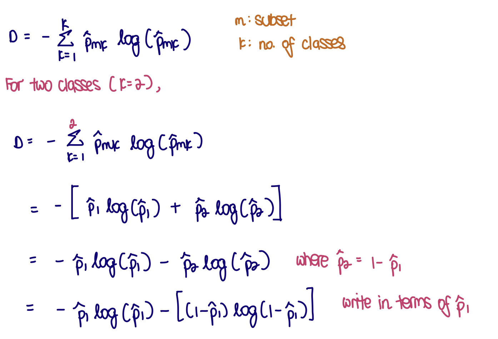
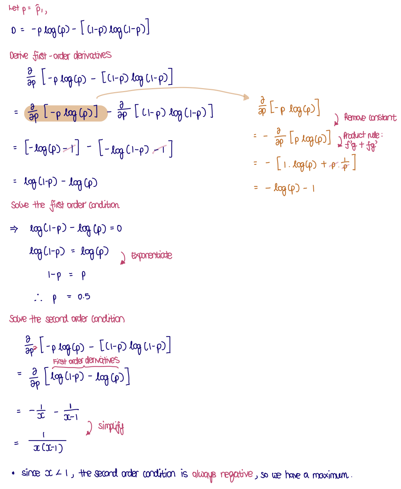
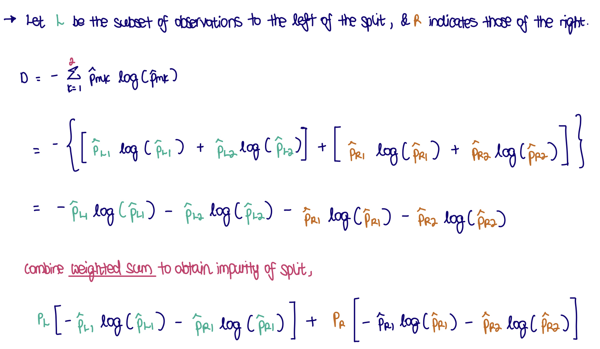
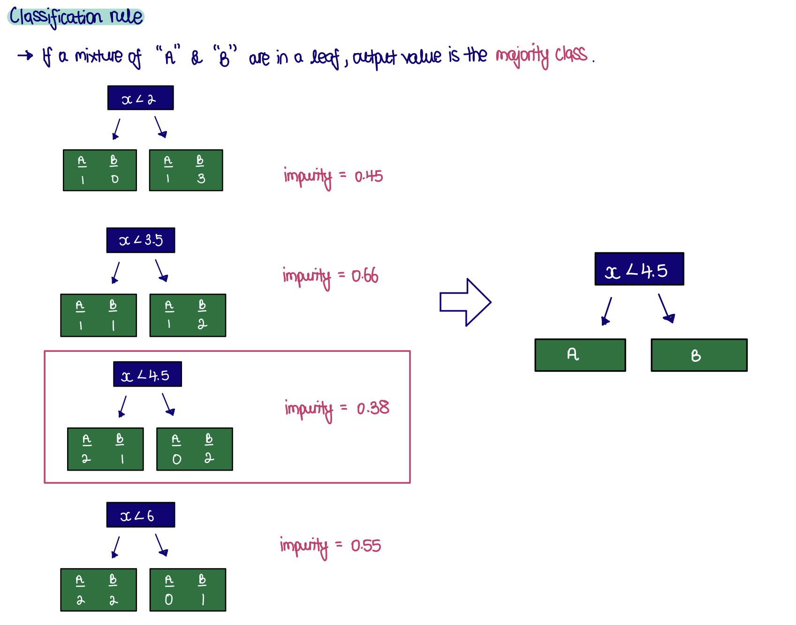

```{r, echo = FALSE, message = FALSE, warning = FALSE, warning = FALSE}
knitr::opts_chunk$set(
  message = FALSE,
  warning = FALSE,
  error = FALSE, 
  eval = FALSE,
  collapse = TRUE,
  comment = "#",
  fig.height = 4,
  fig.width = 8,
  fig.align = "center",
  cache = FALSE
)
```


# 🎯 Objective

The objectives for this week are to 

* Practice fitting a classification tree model
* Understand the way the tree model is fitted based on impurity
* Learn about the relationship between fitting parameters, bias and variance

# 🔧 Preparation 

Make sure you have these packages installed:

```
install.packages(c("tidyverse", "tidymodels", "tourr", "rpart.plot", "discrim"))
```

# 📚 Reading 

- Textbook section 8.1

# 👋 Getting started

If you are in a zoom tutorial, say hello in the chat. If in person, do say hello to your tutor and to your neighbours. 

```{r setup, include=FALSE}
library(tidyverse)
library(knitr)
library(kableExtra)
library(tidymodels)
library(rpart.plot)
library(discrim)
library(tourr)

options(digits = 2)

# Set default theme for document
ggplot2::theme_set(theme_bw())
```

# 🔩 Exercises 

## Exercse 1

This question is about entropy as an impurity metric for a classification tree.

### a.

Write down the formula for entropy as an impurity measure for two groups. 

```{r, eval=FALSE}

```

**Purity/impurity metrics**

* Entropy ($D$) & Gini ($G$) is used as a **splitting criteria**, it measures the extent of 'purity' for a subset of observations from various classes. 
  * *e.g.* If we have groups of 5 red and 0 blue, that group of 5 is 100% pure.
  * *e.g.* If we have 3 red and 1 blue, that group is either 75% or 81% pure, if we use Gini or Entropy respectively.
* In both indices, the lower the value the better.

### b. 

Establish that the the worst case split has 50% one group and 50% the other group, in whatever way you would like (algebraicly or graphically).

```{r out.width="50%"}
# Select a range of probability
p <- seq(0.01, 0.99, 0.01)

# Compute Entropy impurity
y <- -p * log(p) - (1 - p) * log(1 - p)

# Convert to tibble for plotting
df <- tibble(p, y)
```

**Graphically**

```{r}
ggplot(df, aes(x = p, y = y)) +
  geom_line() +
  labs(y = "Entropy (D)")
```

Worse case split is at 50%, where entropy value is the highest.

**Algebraicly**

```{r, eval=FALSE}

```

### c.

Extend the entropy formula so that it can be used to describe the impurity for a possible split of the data into two subsets. That is, it needs to be the sum of the impurity for both left and right subsets of data.

```{r}

```

## Exercise 2

Computing impurity

### a. 

Compute the entropy impurity metric for all possible splits.

For this sample of data, 

```{r eval=TRUE, echo=FALSE}
df <- 
  tibble(x = c(1, 3, 4, 5, 7),
         y = c("A", "B", "A", "B", "B"))

kable(df) %>% kable_styling()
```

```{r}
# View dataset 
df %>% 
  ggplot(aes(x = x, y = y)) + 
  geom_point(size = 5)
```


```{r}
splits <- 
  tibble(
    split = c(2, 3.5, 4.5, 6), 
    impurity = c(
      4 / 5 * (-1 / 4 * log(1 / 4) - 3 / 4 * log(3 / 4)), 
      2 / 5 * (-2 * 1 / 2 * log(1 / 2)) + 3 / 5 * (-1 / 3 * log(1 / 3) - 2 / 3 * log(2 / 3)), 
      3 / 5 * (-2 / 3 * log(2 / 3) - 1 / 3 * log(1 / 3)), 
      4 / 5 * (-2 * 1 / 2 * log(1 / 2))))

splits %>% kable() %>%
  kable_styling(full_width = F)
```


### b.

Write down the classification rule for the tree that would be formed for the best split.

* The best split is where entropy impurity is the lowest, *i.e.* $x < 4.5$ 

```{r}

```

    
## Exercise 3

Write decision tree model.

For the following data set, compute the default classification tree. Write out the tree rules, and also sketch the boundary between classes.

### a.

olive oils, for three regions

```{r}
olive <- read_csv("http://www.ggobi.org/book/data/olive.csv") %>%
  rename(name = `...1`) %>%
  dplyr::select(-name, -area) %>%
  mutate(region = factor(region))
```

```{r echo=FALSE}
class_tree_spec <- 
  decision_tree() %>%
  set_engine("rpart") %>%
  set_mode("classification")

olive_rp <- class_tree_spec %>%
  fit(region ~ ., data = olive)

olive_rp
```

```{r}
olive_rp %>%
  extract_fit_engine() %>%
  rpart.plot()

olive_rp %>% 
  extract_fit_engine() %>% 
  prp(type = 3, ni = TRUE, nn = TRUE, extra = 2, box.palette = "RdBu")

ggplot(olive, aes(x = eicosenoic,
                  y = linoleic,
                  colour = region)) +
  geom_point() + 
  scale_color_brewer("", palette="Dark2") +
  geom_vline(xintercept = 6.5) +
  annotate("line", x = c(0, 6.5), y = c(1053.5, 1053.5)) +
  theme(aspect.ratio = 1)
```

### b.

chocolates, for type

```{r}
choc <-  read_csv(here::here("data/chocolates.csv")) %>%
  select(Type:Protein_g) %>%
  mutate(Type = factor(Type))
```

```{r echo=FALSE}
choc_rp <- class_tree_spec %>%
  fit(Type ~ ., data = choc)

choc_rp
```

```{r}
choc_rp %>%
  extract_fit_engine() %>%
  rpart.plot()

choc_rp %>% extract_fit_engine() %>% 
  prp(type = 3, ni = TRUE, nn = TRUE, extra = 2, box.palette = "RdBu")

ggplot(choc, aes(x=Fiber_g, y=CalFat, colour=Type)) +
  geom_point() + 
  scale_color_brewer("", palette="Dark2") +
  geom_vline(xintercept=4.83) +
  annotate("line", x=c(0, 4.83), y=c(337.7, 337.7)) +
  theme(aspect.ratio = 1)
```

### c. 

flea, for species

```{r}
data(flea)
```

```{r echo=FALSE}
flea_rp <- class_tree_spec %>%
  fit(species ~ ., data = flea)

flea_rp
```

```{r}
flea_rp %>%
  extract_fit_engine() %>%
  rpart.plot()

flea_rp %>%
  extract_fit_engine() %>% 
  prp(type = 3, ni = TRUE, nn = TRUE, extra = 2, box.palette = "RdBu")

ggplot(flea, aes(x=aede3, y=tars1, colour=species)) +
  geom_point() + 
  scale_color_brewer("", palette="Dark2") +
  geom_vline(xintercept=93.5) +
  annotate("line", x=c(93.5, 123), y=c(159, 159)) +
  theme(aspect.ratio = 1)
```

## Exercise 4

Which model should perform best

For the crabs data, make a new variable combining species and gender into one class variable.

```{r}
crabs <- read_csv("http://www.ggobi.org/book/data/australian-crabs.csv") %>%
  mutate(class = interaction(species, sex)) %>%
  dplyr::select(-index, -species, -sex)
```

### a. 

Use the grand and guided tour with the LDA index to examine  the data. Describe the shape. Between LDA and a classification tree which do you expect to perform better on this  data?
    
```{r, eval=FALSE}
# Grand tour
animate_xy(crabs[,1:4], col = crabs$class)

# Guided tour with LDA projections
animate_xy(crabs[,1:4],
           guided_tour(lda_pp(crabs$class)),
           col = crabs$class)
```

* The variables are highly correlated, and the difference between groups uses a combination of variables. 
  * Trees will have a difficult time with this data. LDA should perform better.
* Strongly correlated between the variables, they're join at one end, and then they fan out a little 

### b.

Use 10-fold cross-validation to determine the best choice of `minsplit`, for the training set of an 80:20 training:test split of the original data. (Check the code from the lecture 6a/b notes to use as an example.)

```{r}
set.seed(20200429)
crabs_split <- initial_split(crabs, prop = 0.8)
crabs_tr <- training(crabs_split)
crabs_ts <- testing(crabs_split)
```

```{r, eval=FALSE}
# Classification tree, with hyperparameters tuning
tune_spec <- 
  decision_tree(cost_complexity = tune::tune(), 
                min_n = tune::tune()) %>% # minimum split  
  set_engine("rpart") %>% 
  set_mode("classification")

# 10-fold cross validation
crabs_folds <- vfold_cv(crabs_tr, 10)

# Create grid having
## rows containing tuning parameter candidates
## columns containing each tuning parameter
tree_grid <-
  expand_grid(min_n = 5:20,
              cost_complexity = c(0.01, 0.005, 0.001))

# Define workflow
tree_wf <- 
  workflow() %>%
  add_model(tune_spec) %>%
  add_formula(class ~ .)

# Compute set of performance metrics using pre-defined tuning parameters
tree_res <- 
  tree_wf %>% 
  tune::tune_grid(resamples = crabs_folds, # 10-fold cv
                  grid = tree_grid)
```


```{r,  out.width = "80%"}
# Obtain results from different hyperparameter combinations
# Select accuracy metric
crabs_tune <- tree_res %>%
  tune::collect_metrics() %>%
  mutate(min_n = factor(min_n)) %>%
  filter(.metric == "accuracy") %>%
  mutate(min_n = as.numeric(as.character(min_n)))

# Visualise model fit (accuracy metric) for different hyperparameter combinations
crabs_tune %>%
  ggplot() +
  # Mean for each combination of cost complexity (`cp`) and minimum split
  geom_line(aes(x = min_n, 
                y = mean, 
                colour = cost_complexity,
                group = cost_complexity), 
            size = 1.5, alpha = 0.6) +
  geom_point(aes(x = min_n, y = mean, 
                 colour = cost_complexity), 
             size = 2) +
  # Confidence interval for each parameter combination
  geom_errorbar(aes(x = min_n, 
                    ymin = mean - std_err, 
                    ymax = mean + std_err,
                    colour = cost_complexity))
```

* The plot above shows the 10-fold cross-validation results for different choices of cost_complexity and min_n (minsplit)
* The different folds give multiple values, and hence the mean and a confidence interval can be computed for each parameter combination. 
* Regardless of the choice of parameter, the accuracy is fairly similar, especially for smaller values of min_n

```{r out.width = "80%"}
# Select best model, based on accuracy
best_tree <- tree_res %>%
  tune::select_best("accuracy")

# Obtain workflow for best model
final_wf <- 
  tree_wf %>% 
  finalize_workflow(best_tree)

# Fit best model onto training set
final_tree <- 
  final_wf %>%
  fit(data = crabs_tr) %>%
  extract_fit_parsnip()

# View decision tree
prp(final_tree$fit, type = 3, ni = TRUE, 
    nn = TRUE, extra = 2, box.palette = "RdBu")
```

### c.

Fit the classification tree with the recommended minsplit. Compute the test accuracy, using your 20% test set. Explain why the tree is so complicated. Compare with the accuracy from an LDA. Is this consistent with what you thought would be the best model?

```{r echo=FALSE, out.width = "80%"}
# Assessing model
crabs_ts_pred <- augment(final_tree, crabs_ts)
yardstick::conf_mat(crabs_ts_pred, class, .pred_class) 
metrics(crabs_ts_pred, truth = class, estimate = .pred_class)
```

```{r}
# LDA
lda_mod <- discrim_linear() %>% 
  set_engine("MASS") %>% 
  translate()

crabs_lda_fit <- 
  lda_mod %>% 
  fit(class ~ ., 
      data = crabs_tr)

crabs_lda_pred <- augment(crabs_lda_fit, new_data = crabs_ts)

metrics(crabs_lda_pred,
        truth = class, 
        estimate = .pred_class) 
```

**The LDA model outperforms the tree model substantially.**

##### © Copyright 2021 Monash University
