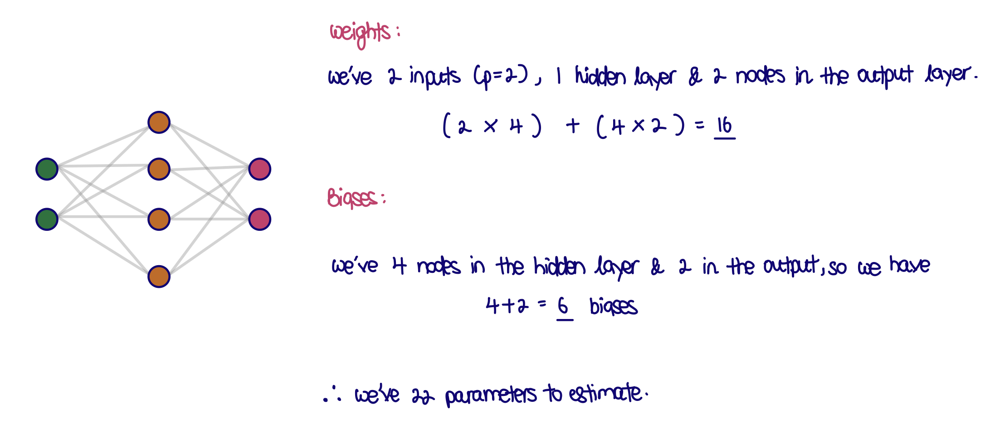
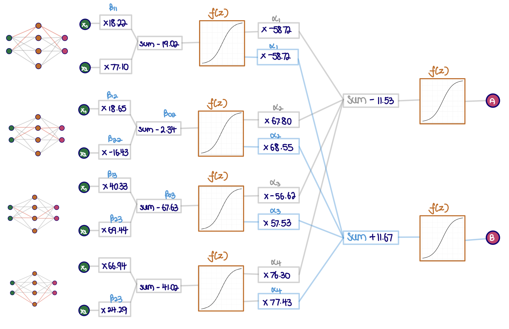
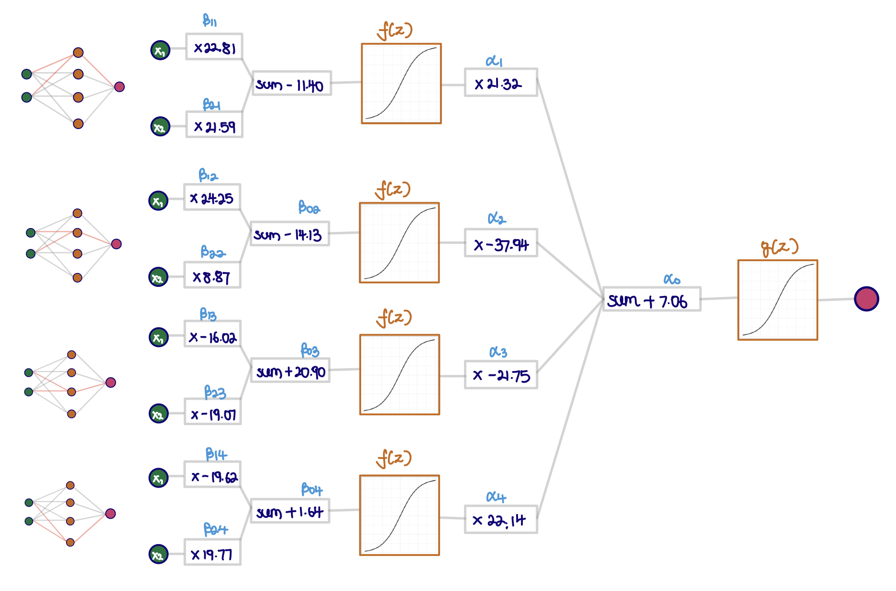

```{r, echo = FALSE, message = FALSE, warning = FALSE, warning = FALSE}
knitr::opts_chunk$set(
  message = FALSE,
  warning = FALSE,
  error = FALSE, 
  eval = FALSE,
  echo = TRUE,
  collapse = TRUE,
  comment = "#",
  fig.height = 4,
  fig.width = 8,
  fig.align = "center",
  cache = FALSE
)
```


# 🎯 Objective

The objectives for this week are to 

* Learn about fitting a neural network model 
* Break down the black box of a single hidden layer model

# 📕 Reading 

In this problem we will replicate what was done in Section 6, of https://vita.had.co.nz/papers/model-vis.pdf. Please read this first! It documents a struggle with getting the neural network to fit to a reasonably simple problem. 

# 👽 Exercises 

This exercise is investigating neural network model fitting. A neural network model was fitted to the `wiggle.csv` using the `nnet` package in R, from many random starts, and using 2-4 nodes in the hidden layer. The best model is in the data object `nnet_best.rda`, and the full set of model fits are stored in `nnet_many.rda`. We are going investigate the best fit, and the complete set of fits. The data set is actually a test set, it was not used to fit the model, but it was simulated from the same process as the training set, which we don't have.

```{r setup, include=FALSE}
library(tidyverse)
library(knitr)
library(nnet)
library(patchwork)

# Set default theme for document
ggplot2::theme_set(theme_bw())

select <- dplyr::select
```

## 1. 

Read in the data, and make an appropriate plot, that communicates the relationship between the two variables and the two groups.

```{r}
# Read-in data
w <- read_csv(here::here("data/wiggly.csv"))
```

```{r}
# View dataset
ggplot(data = w,
       aes(x = x,
           y = y, 
           colour = class,
           shape = class)) + 
  geom_point() +
  scale_color_brewer("", palette="Dark2") +
  scale_shape("") +
  theme(aspect.ratio = 1)
```

## 2. 

Read in the best model. Take a look at the object. There are three components: `hidden`, `output` and `nnet`. The best model uses $s=4$. The `nnet` component has the estimated model coefficients, fitted values and residuals. The `hidden` component has information related to the models used in the 4 nodes of the hidden layer, and the `output` has the same information for the second layer. These latter two contain a grid of values for the predictors, $x$, $y$ and the predicted values for each grid point. 

### a. 

Plot the grid of predicted values for the second layer, using node 1. Overlay the data. How well has the model captured the class structure?

```{r}
# Read-in data
load(here::here("data/nnet_many.rda")) # many
load(here::here("data/nnet_best.rda")) # best

best$hidden 
best$output
best$nnet # model fit
```

```{r}
# Image plot for node 1
best$output %>% 
  filter(node == 1) %>% 
  ggplot(aes(x = x, y = y)) + 
  # Predictions
  geom_raster(aes(fill = pred)) +
  # Overlay with data
  geom_point(aes(shape = class), data = w) +
  scale_fill_gradient2(low = "#1B9E77", high = "#D95F02", mid = "white", midpoint = 0.5) +
  theme(aspect.ratio = 1)

# Contour lines for node 1
best$output %>% 
  filter(node == 1) %>% 
  ggplot(aes(x = x, y = y)) + 
  # Predictions
  geom_contour(aes(z = pred), breaks = c(0.1, 0.25, 0.5, 0.75, 0.9)) +
  # Overlay with data
  geom_point(aes(shape = class,
                 colour = class), data = w) +
  scale_colour_brewer(palette = "Set1", direction = -1) +
  theme(aspect.ratio = 1)
```

(1) *Image plot* shows probability at each location
(2) *Contour lines* summarise shapes, here at 10%, 25%, 50%, 75% and 90%.

* The 50% boundary determines if a new observation is classified as class A or B
  * The model does amazingly well to predict the data

### b. 

Plot the grid of predicted values for each node in the hidden layer, with the data overlaid. Explain how the models at each node would combine to make the final model predictions, which we have already seen are extremely good.

```{r}
best$hidden %>% 
  ggplot(aes(x, y)) +
  # Predictions
  geom_raster(aes(fill = pred)) +
  # Overlay with data 
  geom_point(aes(shape = class), data = w) +
  scale_fill_gradient2(low = "#1B9E77", high = "#D95F02", mid = "white", midpoint = 0.5) +
  facet_wrap(~ node, nrow = 1) +
  theme(aspect.ratio = 1) 
```

```{r}
best$hidden %>%
  ggplot(aes(x = x, y = y)) +
  # Data 
  geom_point(aes(shape = class,
                 colour = class), data = w) +
  # Overlay with contour lines for each hidden node
  geom_contour(aes(z = pred, group = factor(node)),
               size = 1.5,
               colour = "grey50",
               breaks = 0.5) +
  scale_colour_brewer(palette = "Set1", direction = -1) +
  scale_shape("class") +
  theme(aspect.ratio = 1)
```

* Figure displays the output for each hidden node, superimposing the 50% contour line on a single plot
* Each node captures one linear aspect to produce a non-linear classification boundary.

### c. 

How many parameters are there in this model? Check that your answer matches the number of values in the `wgts` element of the `nnet` component.

```{r}

```

```{r}
best$nnet
best$nnet$wts
```


### d. 

Write down the equation corresponding to the model at first node of the hidden layer. You need to look at the `wgts` element of the `nnet` component. There are 6 sets of linear model coefficients. 

**The coefficients are:**

```{r}
# Weights and biases
best$nnet$wts 

# Model summary
summary(best$nnet) 
```

* `i`: Input 
* `h`: Hidden layer
* `o`: Output

```{r}
# Equation for first node of the hidden layer
include_graphics(path = "images/2d-equation.jpeg")
```

### e. 

ADVANCED: See if you can compute the combination of the prediction on each hidden node, to get final prediction.

```{r}
# Model summary
best$nnet$wts
summary(best$nnet)
```

```{r}

```

## 3. 

Read in the complete set of models fitted. There were 600 models fitted, 200 random starts for each $s = 2, 3, 4$. The `nnet` function has its own measure of the goodness of fit, which is used to determine when to stop minimising RSS, which is called `value` in this data. (You can think of this like it is training error). Plot the predictive accuracy against function's returned value of model fit. Explain how the change in $s$ affects the predictive accuracy. 

```{r}
qual <- 
  many %>% 
  select(value, accuracy, nodes, id) %>%
  distinct()

# Summary of the 600 models fitted
ggplot(data = qual, aes(accuracy, value)) + 
  geom_point() + 
  xlab("Predictive accuracy") + ylab("Value of fitting criterion") +
  facet_wrap(~ nodes)
```

* The parameters (weights and biases) are estimated via numerical optimisation like gradient descent.
* There is some variation in the ability to correctly separate the two classes, with the prediction accuracy ranging from 80 - 100%.
  * Increasing the no. of nodes (`s`) increases the number of very good and bad models
* A different random start can generate a very poor model. It takes some work to find the best model. But it can be a very good model.


## 4.

Your turn, use the `nnet` function to fit the wiggly data yourself. Split the wiggly data into training and test sets.

Set a seed, and choose $s=4$. Record the RSS (`value`), and the accuracy for the test set.

Where does your fit lie in terms of all the models Hadley fitted to the data? 

Run it again (without re-setting the seed). Is it a different model?

```{r}
set.seed(2022)
library(rsample)
library(yardstick)

# Convert response to factor
w <- w %>% mutate(class = factor(class))

# Split into training & test set
split <- initial_split(w, 2/3)
w_tr <- training(split)
w_ts <- testing(split)
```

```{r}
# View training data
ggplot(data = w_tr) +
  geom_point(aes(x = x, y = y, colour = class)) +
  scale_colour_brewer("", palette = "Dark2")
```


```{r}
# Fit neural network
# Uses Sigmoid (logistic) activation function by default
m1 <- nnet::nnet(class ~ ., 
                 data = w_tr, 
                 size = 4, # Number of hidden nodes
                 decay = 5e-4, # Weight decay 
                 maxit = 500 # Maximum no. of iterations
                 ) 
summary(m1)
```

```{r}
# Show neural network
NeuralNetTools::plotnet(m1)
```

```{r}

```

```{r}
w_ts <- w_ts %>% 
  mutate(cl_p1_num = predict(m1, w_ts),
         cl_p1 = factor(predict(m1, w_ts, type = "class")))

# Confusion matrix for test set
yardstick::conf_mat(data = w_ts, truth = class, estimate = cl_p1)

# Accuracy for test test
yardstick::accuracy(data = w_ts, truth = class, estimate = cl_p1)
```
* When we change the seed
  * there is a big difference in the model fitting, as indicated by RSS (obtained using `m1$value`), from one fit to another.
  * you can experiment with this at your own time

##### © Copyright 2022 Monash University

